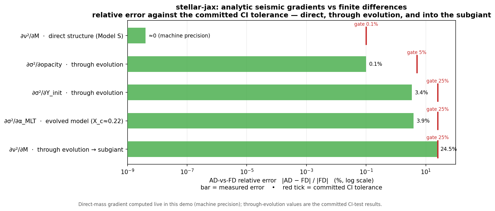
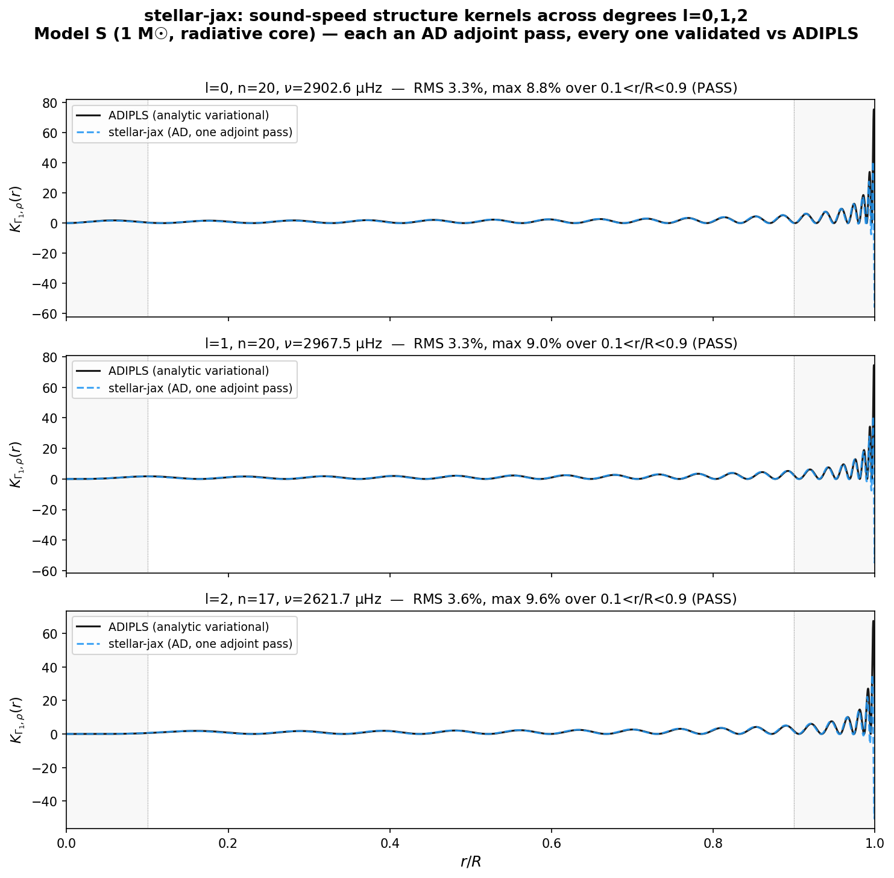
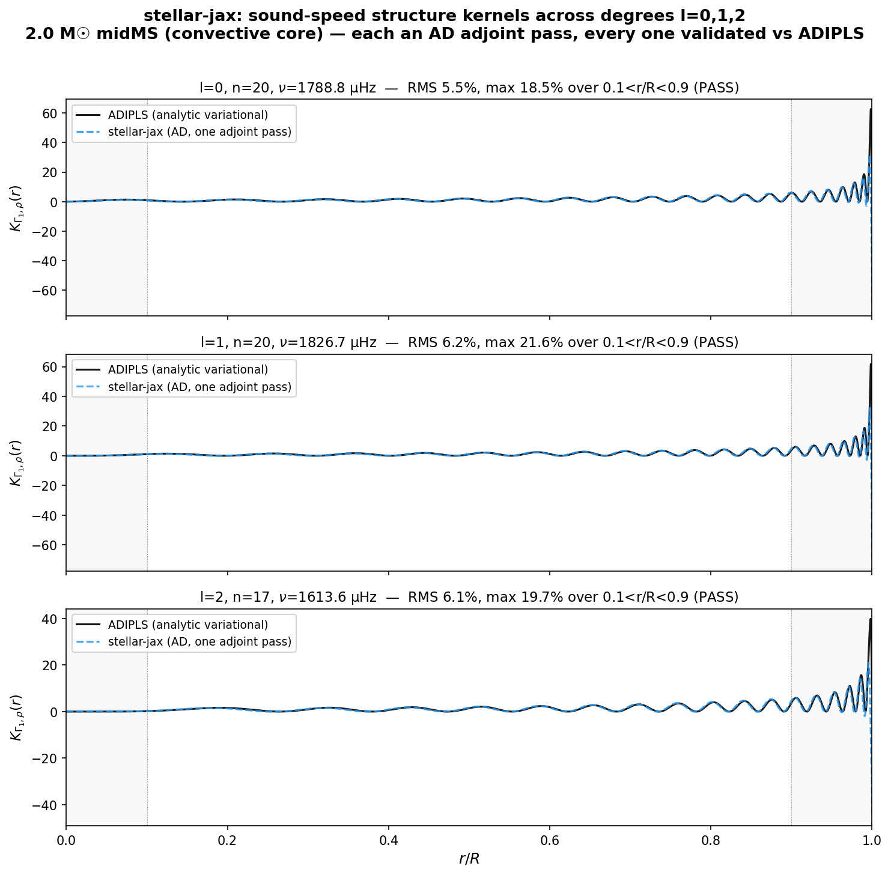
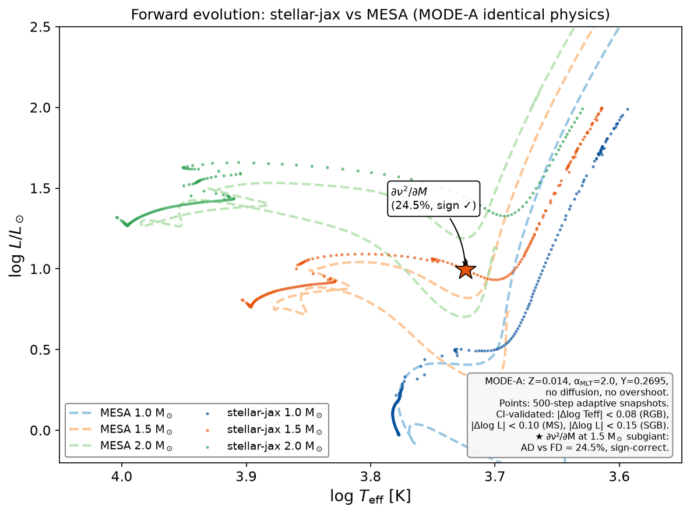

# Differentiable seismic gradients & structure kernels

**The capability:** compute the *analytic gradient* of a stellar oscillation observable with respect to
any stellar physics input — mass, metallicity, opacity, nuclear rate, and the internal sound-speed
profile itself — **end-to-end through stellar evolution, in a single reverse-mode (adjoint) pass**,
validated against finite differences.

This is the primary capability `stellar-jax` was built to demonstrate: exact analytic gradients of a
seismic observable through the physics, which non-differentiable stellar codes do not provide.

> Status: the underlying gradients are implemented, CI-gated, and mutation-guarded (see
> [Validation](#validation)). The runnable demo script and committed figures are in this folder.

---

## Background for readers new to differentiable programming

*(Skip if you already work with automatic differentiation. This section assumes astrophysics familiarity but no JAX / machine-learning background.)*

- **Gradient** — the derivative of an output w.r.t. an input: "if I nudge mass M by a tiny amount, how much does the oscillation frequency ν change, and in which direction?" Written ∂ν/∂M. For many inputs at once it's the vector of all such sensitivities.
- **Finite differences (FD)** — the brute-force way to get a gradient: re-run the whole model with the input nudged (M → M+ε), subtract, divide by ε. One re-run **per input**. Accurate-ish but slow, and it's what the field does today.
- **Automatic differentiation (AD)** — the model is written so the computer can propagate derivatives through every operation *exactly* (to machine precision), not by re-running with nudges. No ε, no truncation error.
- **Reverse-mode AD / "adjoint" / "one pass"** — the key efficiency: AD run *backwards* computes the gradient of **one output w.r.t. ALL inputs simultaneously, at a cost independent of the number of inputs**. So the sensitivity of a frequency to the sound speed at all ~2482 points inside the star comes out of a **single** backward pass — where finite differences would need ~5000 separate model re-runs. This cost-independence of the number of inputs is what makes the structure-kernel result below practical; by finite differences it would be prohibitively expensive.
- **Differentiable model** — a model built (here, in [JAX](https://docs.jax.dev)) so AD works through the *actual physics* (the structure equations, the eigenfrequency solve), not through a neural-network surrogate. The gradients are of the real model, so they are exact, not learned approximations.
- **`jax.grad`** — the JAX function that turns a Python function `f(x)` into a new function that returns ∂f/∂x. That's the whole mechanism used below.
- Why it matters (the payoff, expanded in *Why this is useful*): exact sensitivities let you **calibrate physics** and **invert observations** by gradient descent (step directly toward the best fit) instead of scanning grids — and the cost doesn't blow up as you add parameters.

---

## Running the demo

Two entry points, depending on what you want:

- **Learn the API, step by step → [`tutorial.py`](tutorial.py).** A short, commented,
  linear walkthrough: load a stellar model (the FGONG format is explained), take a
  parameter gradient in one line, compute a structure kernel in one call, and see it
  match ADIPLS. It runs as a plain script **and** opens as a notebook in Jupyter / VS
  Code (it uses the `# %%` cell format), with no saved outputs to go stale.
  ```bash
  python demos/differentiable-seismic-gradients/tutorial.py
  ```
- **Reproduce the full validated figures → `demo_seismic_gradients.py`** (below): the
  Sun + a 2.0 M☉ convective-core star, degrees l=0,1,2, kernels vs ADIPLS + the
  gradient-vs-FD panel.

### Option A — container (recommended; no environment setup, reproducible)

A ready-to-run `Dockerfile` is provided so you can reproduce the figures with **no local Python
setup and no chance of a dependency mismatch** — everything (pinned JAX, the data tables) is baked in,
CPU-only, no network needed at runtime.

```bash
# From the repo ROOT (so the whole package is in the build context):
docker build -f demos/Dockerfile -t stellar-jax-demo .

# Run the full demo (~1–3 min, CPU-only):
docker run --rm stellar-jax-demo

# Copy the generated figures out to ./out:
docker run --rm -v "$PWD/out:/out" stellar-jax-demo \
    sh -c "python demos/differentiable-seismic-gradients/demo_seismic_gradients.py && \
           cp demos/differentiable-seismic-gradients/figures/*.png /out/"
```

### Option B — local install

```bash
# From the repo root (one-time setup; requires Python >= 3.11)
pip install -e .              # pulls jax==0.10.2, jaxlib==0.10.2, numpy, matplotlib (all the demo needs)

# Full demo (~1–3 min on a laptop): M gradient + kernel overlays (Sun + 2 M☉)
python demos/differentiable-seismic-gradients/demo_seismic_gradients.py

# Individual parts
python demos/differentiable-seismic-gradients/demo_seismic_gradients.py --part1   # gradients only (~20 s)
python demos/differentiable-seismic-gradients/demo_seismic_gradients.py --part2   # kernels only (~2–3 min, both stars)

# Include through-evolution gradients (opacity_factor, eps_nuc_factor — ~60+ min)
python demos/differentiable-seismic-gradients/demo_seismic_gradients.py --full

# HR diagram: forward evolution vs MESA (reads pre-computed tracks, ~seconds)
python demos/differentiable-seismic-gradients/generate_hr_tracks.py

# To recompute the stellar-jax forward tracks from scratch (SLOW — hours per mass):
# python demos/differentiable-seismic-gradients/generate_hr_tracks.py --compute
```

The default demo runs in **~1–3 minutes** on a laptop — no XLA compilation of `evolve_star` needed.
Both parts operate directly on committed FGONG structure models (Model S for the Sun; a MESA-evolved
2.0 M☉ midMS model), avoiding the ~10–16 minute `lax.scan` compile that a full `evolve_star` call requires.

**Machine requirements.** CPU-only throughout — no GPU. The default demo (and `--part1` / `--part2`)
runs in roughly 1–2 GB of RAM: it works on committed fixed structure models and never evolves a star.
`--full` triggers a live `evolve_star` and its backward pass — a one-time ~10–16 min XLA compile and
roughly 5–10 GB of RAM.

The demo produces four figures in `figures/`:

**`gradient_vs_fd.png`** — a validation scorecard: the AD-vs-FD relative error of a representative set
of seismic gradients, each shown against its committed CI tolerance (log scale). It spans the
direct-mass path on Model S (computed live in this demo, machine-precision), the full-evolution
gradients (opacity, helium Y, mixing length at an evolved model), and the through-evolution ∂ν²/∂M into
the subgiant. Every gradient sits within its CI gate. Only the direct-M point is computed live in this demo; the
other rows are the committed CI-test results. The opacity and ε_nuc gradients can be recomputed live
with `--full` (near-ZAMS, ~30 min each); the subgiant row is reproduced by its own CI test — see the
note below.



**The demo does not evolve a star to the subgiant.** The through-evolution ∂ν²/∂M into the subgiant
shown above (and in the summary table) is cited from the committed CI test
`test_replay_gradient_seismic_subgiant` — not computed during a demo run. To reproduce it live:
`pytest tests/test_evolution.py -k test_replay_gradient_seismic_subgiant` — a heavy through-evolution
gradient that is memory-promoted in CI (needs roughly 60 GB of RAM) and takes on the order of an hour;
not a typical laptop run.

**`kernel_vs_adipls.png`** — Γ₁ structure kernels K_{Γ₁,ρ}(r) on the **Sun (Model S, radiative core)**
for **three angular degrees (l=0, 1, 2)**, each over the full ~2482-point interior in one adjoint pass,
overlaid on the ADIPLS analytic variational kernel (Christensen-Dalsgaard 2008). Peak-normalized errors:
~8.8–9.6% max, ~3.3–3.6% RMS over 0.1 < r/R < 0.9 (≤10%). Obtaining this by finite differences would
need ~4964 eigenvalue solves *per mode*.



**`kernel_vs_adipls_2Msun.png`** — the **same** kernels on a structurally very different star: a
**2.0 M☉ midMS model with a large convective core**, again for l=0, 1, 2, overlaid on its own genuine
ADIPLS references. Agreement: ~5.5–6.2% RMS (≤10%), with node-crossing max scatter up to ~22% —
these modes are lower-frequency (~1600–1830 µHz) than the solar set (>2500 µHz), so the peak-norm max
error concentrates at a few points near a kernel node, exactly as the solar validation documents for
ν < 2500 µHz. This is the evidence that the kernels generalize: the *same* one-adjoint-pass AD machinery
reproduces the ADIPLS kernels on both a radiative-core and a convective-core interior — the kernels
reflect the physics, not a Sun-specific tuning.



**`hr_tracks_vs_mesa.png`** — Forward-evolution HR diagram: stellar-jax adaptive-step snapshots
(scatter points) overlaid on identical-physics MESA reference tracks (dashed lines) for **1.0, 1.5,
and 2.0 M☉**, from ZAMS through the subgiant branch and up the lower RGB. This is the missing
evolved-regime picture — the first three figures above show fixed-structure capabilities (kernels,
gradients on a single model); this one shows the **through-evolution** agreement that underpins the
subgiant gradient. The star marker on the 1.5 M☉ track is the operating point where the
through-evolution ∂ν²/∂M is evaluated (24.5%, sign-correct). The scatter points are 500-step
adaptive snapshots (practical compute time); the CI suite validates each phase against MESA
separately: |Δlog L| < 0.10 dex on the MS (`test_mesa_comparison`),
median |Δlog Teff| < 0.08 dex on the RGB (`test_adaptive_forward_rgb_{1p0,1p5,2p0}`).
Provenance and the exact physics config are in
[`figures/hr_tracks_vs_mesa_caption.md`](figures/hr_tracks_vs_mesa_caption.md).



To regenerate:
```bash
python demos/differentiable-seismic-gradients/generate_hr_tracks.py
```
(Uses pre-computed track data in `data/`; run `--compute` to recompute from scratch — hours.)

### What the demonstration covers

The demo produces four figures (three in a couple of minutes from committed FGONG data, plus the HR
track overlay from pre-computed forward-evolution data), and it deliberately shows the capability
across **both** axes an expert would probe — the mode spectrum, and stellar structure:

- **Across oscillation modes** — the structure kernel is computed and validated against ADIPLS for
  degrees **l = 0, 1, 2** (the modes asteroseismic inversions actually use). Different l have physically
  distinct kernels — their inner turning points migrate outward with l — so the multi-l overlay shows the
  method reproduces the correct *l-dependent radial structure*, not just one number. Accuracy degrades
  gracefully for very low-frequency modes (ν < 2500 µHz) whose energy sits near the surface — stated
  honestly, not hidden.
- **Across stellar structure** — the kernels are validated on **two structurally very different stars**:
  the Sun (Model S, 1 M☉, **radiative** core) and a **2.0 M☉ midMS model (large convective core)**. The
  same one-adjoint-pass AD code reproduces the ADIPLS kernels on both (solar ≤10% peak-norm; 2.0 M☉
  ≤10% RMS). This is direct evidence that the kernels reflect **the physics, not Sun-specific tuning**.
- **Across physics parameters** — dedicated AD-vs-FD gradients for **M, opacity, nuclear rate (eps_nuc),
  Z, helium (Y), mixing-length (α_MLT), and overshoot (f_ov)**, each its own CI-gated, mutation-guarded
  test asserting sign and magnitude. The helium gradient ∂ν/∂Y (central to the M–Y age degeneracy) is
  now sign-correct and accurate (~3.4%) — historically the hard one — and α is validated both near-ZAMS
  and at an evolved (late-main-sequence) model. Frequency **ratios** r₀₂/r₀₁ (the surface-independent
  diagnostic) are differentiable too.
- **The full structure** — each kernel is over all interior mesh points (~2482 for the Sun), not a subsample.

**Scope note (honest):** the *per-parameter* seismic gradients now span the composition, mixing, and
structure inputs (M, opacity, eps_nuc, Z, Y, α_MLT, f_ov) plus the surface-independent ratios, and the
mixing-length gradient is validated **into the evolved regime** (α at X_c≈0.22, N=500 — a
late-main-sequence model, ~70% of central H consumed, not just near-ZAMS). The **structure kernels** are likewise demonstrated beyond
solar-type — validated against ADIPLS on a convective-core 2.0 M☉ star as well as the Sun — so the
kernel capability is structure-agnostic. The through-evolution ∂ν²/∂M into the evolved **subgiant**
is now delivered on main (sign-correct, 24.5%; see the summary table and limitations below).

**What the demo reuses:** every function call in the demo already exists in the CI test suite —
`test_seismic_gradient_direct_M_path`, `test_seismic_gradient_opacity_factor`,
`test_seismic_gradient_eps_nuc_factor`, `TestADvsADIPLSKernel` (Model S), and `TestKernelADIPLS2Msun`
(2.0 M☉). No new physics.

---

## Why this is useful

Asteroseismology infers a star's interior from its oscillation frequencies. Two things repeatedly
require knowing **how sensitive an oscillation frequency is to a change in the star** — i.e. a gradient:

1. **Structure inversions** (the sound-speed profile c²(r) of a real star) need *sensitivity kernels*
   `∂ν/∂c²(r)` — how each observed frequency responds to a change in the sound speed at each radius.
   Classically these are derived analytically (Gough 1991) and recomputed per code, per reference
   model — laborious and error-prone.

2. **Parameter sensitivity / forecasting** (which stellar properties are constrained, and how well)
   needs `∂(observable)/∂(parameter)` — how frequencies respond to mass, composition, opacity, etc.

A differentiable model produces **both, exactly, essentially for free** — one adjoint pass yields the
gradient with respect to *all* inputs at once. Two concrete uses:

- **Sound-speed kernels by autodiff.** `∂ν/∂c²(r)` over the full ~2482-point interior profile is
  obtained in **one** adjoint pass. The finite-difference alternative needs ~2 × (number of radial
  points) eigenvalue solves *per mode* — thousands of solves — which is why the field derives these
  kernels analytically instead. Our code produces them directly and validates them against the
  field-standard ADIPLS analytic kernels on Model S.

- **Physics sensitivities without a giant grid.** The current field workflow makes forecasting
  tractable by precomputing enormous model grids and training neural-network emulators on them
  (2024–2026 literature). A differentiable physics model can deliver the same sensitivities directly
  from the physics, and — crucially — in reverse mode the cost of the gradient is *independent of the
  number of parameters*, which is the regime where grids/emulators struggle (the "curse of
  dimensionality").

---

## What is actually delivered today (honest scope)

**Gradient-vs-FD at a glance** — every row is a committed, mutation-guarded CI test comparing the
analytic (reverse-mode AD) gradient against an independent finite difference. This is a capability the
grid/Bayesian/emulator pipelines do not provide: the gradient of a seismic observable
with respect to the physics, obtained by differentiating the *model itself*. (The **Obs.** column names
the observable each row differentiates — the squared eigenfrequency σ² or the frequency-squared ν²; see
*The observable* under the limitations below.)

| Gradient | Obs. | Star / regime | AD vs FD | Sign | CI test |
|---|---|---|---|---|---|
| **∂/∂M — through evolution to the subgiant** | **ν²** | **evolved subgiant** | **24.5%** (\|Δlog L\|<0.1) | ✓ | `test_replay_gradient_seismic_subgiant` |
| ∂/∂opacity_factor | σ² | 1 M☉, through evolution | < 5% (≈0.1%) | ✓ | `test_seismic_gradient_opacity_factor` |
| ∂/∂eps_nuc_factor | σ² | 1 M☉, through evolution | < 1% | ✓ | `test_seismic_gradient_eps_nuc_factor` |
| ∂/∂Y_init (M–Y degeneracy) | σ² | 1 M☉, through evolution | 3.4% | ✓ | `test_seismic_gradient_Y_init` |
| ∂/∂α_MLT | σ² | 1 M☉, near-ZAMS (N=3) | < 25% | ✓ | `test_seismic_gradient_alpha_mlt` |
| ∂/∂α_MLT (evolved) | σ² / ν² | 1 M☉, late-MS X_c≈0.22 (N=500) | 3.9% / 6.5% | ✓ | `test_seismic_gradient_alpha_subgiant` |
| ∂/∂Z ; ∂/∂Z (full path) | σ² | direct EOS ; through evolution | < 25% | ✓ | `test_seismic_gradient_Z(_full_path)` |
| ∂/∂f_ov | σ² | 1.3 M☉ conv-core, through evol. | STE-bounded | ✓ | `test_seismic_gradient_f_ov` |
| ∂r₀₂/∂θ, ∂r₀₁/∂θ (ratios) | ratio | direct path (Z, M) | < 5% | ✓ | `test_seismic_gradient_r02/_r02_mass/_r01_mass` |
| ∂/∂M (direct structure path) | σ² | Model S (Sun) | ~4×10⁻¹¹ | ✓ | `test_seismic_gradient_direct_M_path` |
| kernels ∂ν/∂c²(r) (independent check) | ν | Sun + 2 M☉ vs ADIPLS | ~3.4% / ~6% RMS | — | `TestADvsADIPLSKernel`, `TestKernelADIPLS2Msun` |

The subgiant row (first row above) carries ∂ν²/∂M through post-main-sequence evolution into the
subgiant — sign-correct and reproduction-verified, AD-vs-FD 24.5%. The few-percent rows above are the
same through-evolution machinery at operating points where the interior is well-conditioned; the
subgiant is a harder regime, where the current agreement is 24.5%. The kernel row is an independent
check of the structure kernels against ADIPLS; mature analytic kernels and SOLA inversion already exist
in the field, so these are shown as a cross-validation of our route rather than a new inversion tool,
and our c² kernel follows from Γ₁ by identity.

**Delivered + validated (CI-gated, mutation-guarded):**
- **Structure kernels** `∂ν/∂c²(r)`, `∂ν/∂ρ(r)` over the full Model S interior in one adjoint pass,
  validated against **ADIPLS** analytic kernels on **two structurally different stars** — the Sun
  (Model S, radiative core; `data/model_s/adipls_kernels/`) and a **2.0 M☉ convective-core star**
  (`data/mesa_comparison/profiles/2.0Msun/adipls_kernels/`), across l=0,1,2.
  Of the results here, these kernels are the least practical to obtain by finite differences, and they
  are shown to be structure-independent.
- **Per-parameter seismic gradients**, each a dedicated AD-vs-FD test asserting correct **sign and
  magnitude** and guarded by a mutation that severs the gradient path:
  - `∂ν²/∂M` (direct structure path) — machine-precision agreement (< 0.1%).
  - `∂ν²/∂opacity_factor` (< 5%) and `∂ν²/∂eps_nuc_factor` (< 1%), **through the full evolution**.
  - `∂ν²/∂Y_init` — **sign-correct and within 3.4%** (< 25% gate). This is the hard one: helium's
    seismic sensitivity was historically **wrong-sign**, and it is central to the mass–helium (M–Y)
    degeneracy that limits asteroseismic ages. Having its gradient correct is a *prerequisite* for any
    gradient-based attack on that degeneracy (it does not by itself resolve the inference degeneracy).
    Fixed by an atmosphere-composition correction in the adjoint (∂(surface P,T)/∂X_surf).
  - `∂ν²/∂α_MLT` — sign-correct, < 25%, both **near-ZAMS (N=3)** and, crucially, at an **evolved model
    (X_c≈0.22, ~5.6 Gyr, N=500 steps through the `lax.scan` backward pass)**: 3.9% for σ² and 6.45% for
    the frequency-squared observable ν². X_c≈0.22 is **late main sequence** (~70% of central hydrogen
    consumed) — a through-evolution seismic gradient validated **well past near-ZAMS**.
  - `∂ν²/∂Z` (direct EOS path) and `∂ν²/∂Z_full_path` (**through the evolution** via κ(Z)) — both < 25%.
- **Differentiable frequency ratios** `∂r₀₂/∂θ`, `∂r₀₁/∂θ` (w.r.t. Z and M) — the **surface-independent**
  diagnostic (Roxburgh & Vorontsov 2003) that asteroseismic inversions prefer because the near-surface
  term cancels. Validated to < 5% on the direct structure path — a quantity asteroseismic inversions
  actually fit, now differentiable.
- Overshoot `∂ν²/∂f_ov` (1.3 M☉ convective core) is also a live, sign-correct gate; its AD-vs-FD tolerance
  is straight-through-estimator-bounded (see the summary table), so we don't feature it in the headline.

**In progress / honest limitations:**
- **Subgiant ∂ν²/∂M magnitude agreement is 24.5%, not yet tighter.** The through-evolution `∂ν²/∂M` at
  a *fully* evolved **subgiant** (deep in the H-shell-burning regime) is a **delivered, closed,
  mutation-guarded CI gate** — sign-correct and reproduction-verified (|Δlog L| < 0.1), AD-vs-FD
  **24.5%**. The residual is **not** a broken gradient (sign and radial structure are exact); tightening
  the magnitude below 24.5% remains open.
- **The observable.** The observable of interest is the frequency ν (ν = σ/2π). The fixed-structure figures here
  differentiate σ² (a monotone transform of ν); the through-evolution subgiant gradient differentiates
  **ν²** directly. Same physics — each regime reports the quantity it is best-conditioned in.
- We do **not** claim a speed advantage over an ML emulator on wall-clock. The advantage is **exactness**
  (physics-faithful analytic gradients) and, in high dimension, cost-independence of parameter count.

---

## Validation (claim → test)

| Claim | Validated by |
|---|---|
| `∂ν/∂c²(r)`, `∂ν/∂ρ(r)` match ADIPLS analytic kernels on the **Sun (Model S, radiative core)** — l=0,1,2 | `tests/test_kernel_adipls_validation.py::TestADvsADIPLSKernel` + `data/model_s/adipls_kernels/` |
| The same kernels match ADIPLS on a **2.0 M☉ convective-core star** — l=0,1,2, ≤10% RMS (not Sun-specific) | `tests/test_mode_selection_2msun.py::TestKernelADIPLS2Msun` + `data/mesa_comparison/profiles/2.0Msun/adipls_kernels/` |
| Per-parameter seismic gradients — sign + magnitude vs FD (M, opacity, ε_nuc, Y, α near-ZAMS + evolved, Z direct + through-evolution, f_ov, the surface-independent ratios, and the through-evolution ∂ν²/∂M into the subgiant) | the `test_seismic_gradient_*` / `test_replay_gradient_seismic_subgiant` tests named in the summary table above |
| Cowling vs full-equation frequency ratio — across l=0–2, n≈9–25 (~57 modes) | `tests/test_oscillations.py` Cowling-ratio tests |

The kernel rows cover l=0,1,2 on **both** the Sun (Model S) and a 2.0 M☉ convective-core star — the
demo plots exactly this set, so the figures show the full validated comparison rather than a single mode.

All are registered in `tests/ci_validation_tests.txt` and gated by mutation tests that must fail when
the corresponding gradient path is severed.

**Honest scope of the per-parameter gradients (read before quoting them):** ∂ν/∂{M, opacity, eps_nuc,
Z, α_MLT, **Y**, f_ov} are all sign-correct and validated as live, mutation-guarded CI gates. ∂ν/∂**Y**
(helium) — historically wrong-sign because it is dominated by the convective-boundary *position*, a
known-hard "moving material boundary" gradient — is **now fixed** (sign-correct, ~3.4%) via an
atmosphere-composition correction in the adjoint. Helium is central to the M–Y degeneracy that limits
asteroseismic ages, so a correct ∂ν/∂Y is a prerequisite for gradient-based work on that degeneracy —
not, by itself, a resolution of it. The through-evolution `∂ν²/∂M` at a *fully* evolved
subgiant is now delivered (sign-correct, 24.5%; see the summary table).
